# Class Notes - Fall 2020 - Intro to Programming
Contact: Mark Sherman <shermanm@emmanuel.edu>

<!--ts-->
   * [Class Notes - Fall 2020 - Intro to Programming](#class-notes---fall-2020---intro-to-programming)
   * [August 26,2020](#august-262020)
      * [Coordinate system](#coordinate-system)
   * [August 31, 2020](#august-31-2020)
      * [functions](#functions)
      * [IF if/else "conditional"](#if-ifelse-conditional)
      * [VARIABLE](#variable)
      * [Expression](#expression)
   * [September 2](#september-2)
      * [Comparators to compare values](#comparators-to-compare-values)
      * [Logical Operators](#logical-operators)
   * [September 7, 2020](#september-7-2020)
   * [September 9, 2020](#september-9-2020)
      * [Operator Precedence](#operator-precedence)
      * [Logic Practice](#logic-practice)
   * [Monday 14 September 2020](#monday-14-september-2020)
      * [Starting Ch. 5 in the MAKE book](#starting-ch-5-in-the-make-book)
      * [What is abstraction?](#what-is-abstraction)
   * [Wednesday 16 September 2020](#wednesday-16-september-2020)
      * [Variable "Scope"](#variable-scope)
      * [keyCode](#keycode)
   * [Thursday 21 September 2020](#thursday-21-september-2020)
   * [Wednesday 23 September 2020](#wednesday-23-september-2020)
      * [Starting Chapter 6!](#starting-chapter-6)
   * [Monday 28 September](#monday-28-september)
   * [Wednesday 30 September](#wednesday-30-september)
   * [Monday 05 October](#monday-05-october)
      * [NESTED LOOPS](#nested-loops)
   * [Wednesday 7 October](#wednesday-7-october)
   * [Monday 12 October](#monday-12-october)
      * [Arrays](#arrays)
   * [Wednesday 14 October](#wednesday-14-october)
      * [Looping over Arrays](#looping-over-arrays)
      * [Understanding nested function calls:](#understanding-nested-function-calls)
      * [Odd and Even](#odd-and-even)
   * [Monday 19 October](#monday-19-october)
      * [Functions: theory and practice](#functions-theory-and-practice)
   * [Wednesday 21 October](#wednesday-21-october)
      * [Reviewing Our "Stack"](#reviewing-our-stack)
      * [Events](#events)
      * [Typing Into An Array](#typing-into-an-array)
   * [Monday 26 October](#monday-26-october)
      * [How To Move the Heavens](#how-to-move-the-heavens)
   * [Wednesday 28 October](#wednesday-28-october)
      * [Old-School Practice with Arrays](#old-school-practice-with-arrays)
      * [Sidenote: Rounding Error](#sidenote-rounding-error)
   * [Monday 2 November](#monday-2-november)
      * [Introducing Objects](#introducing-objects)
   * [Wednesday 4 November](#wednesday-4-november)
      * [Objects as sprites](#objects-as-sprites)
      * [Going inside an object](#going-inside-an-object)
   * [Monday 9 November](#monday-9-november)
   * [Wednesday 11 November](#wednesday-11-november)
      * [Media (ch. 7)](#media-ch-7)
      * [Linting](#linting)
   * [Monday 16 November](#monday-16-november)
      * [Motion (Ch. 8) - Animation](#motion-ch-8---animation)
   * [Tuesday 18 November](#tuesday-18-november)
      * [Circular Motion](#circular-motion)

<!-- Added by: shermanm, at: Wed Nov 18 15:54:05 EST 2020 -->

<!--te-->

# August 26,2020

Library: p5.js

JavaScript - language
	"interpreted" - a program reads the code, and does it
	
Calling a function

	functionName ( any parameter separated by commas )
	
	createCanvas(200, 100)
	background(210)
	
	madeUpFunction();
	
the parenthesis are what make it a function CALL

; semicolon ends an expression
	technically, in javascript, they SEPARATE expressions
	
## Coordinate system
	0,0 is in the upper-right corner
	x moves left
	y moves down
	x,y


# August 31, 2020

## functions
	collections of code that can be called (run)
	a function must be DEFINED
	to call a function, name()
	pass parameters to the function in the parens goFunction(2, true)
	
## IF if/else "conditional"

	if (condition) {
		body if true
	}
	
	if (condition) {
		body if true
	} else {
		body if false
	}
	
	a condition statement is an expression that resolves to true or false

## VARIABLE

	name, contain (refer to) a value, declared before they can be used
	
	let x = 5;
	var y = 5;
	
	"let" declares a new variable
		"var" also declares a new varible
		"const" declares a new variable, but doesn't let you change the value
		
	= is the assignment operator
	
	if (x === 7){
		...;
	}
	
	Comparator Operators
		compare values
		return true or false - perfect for an if!
		
		> greater than
		< less than
		>= greater than or equal to
		<= less than or equal to
		=== is equal to
		== is equal to (but less good)
		!= not equal to
		
https://p5js.org/reference/

www.w3schools.com

## Expression
	a piece of code
	let x = 5;
	expressions can be built out of other expressions
	
	I [want to] [go to] [somewhere]
	
	if (something that must resolve to true or false)
	
	can resolve to a value

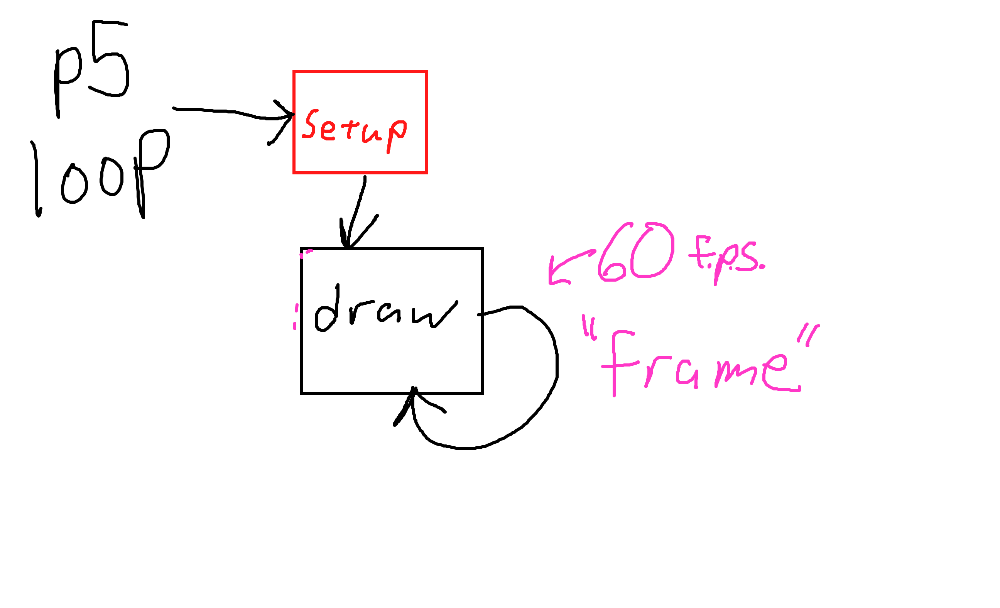


	
# September 2
<https://integrity.mit.edu/handbook/writing-code>

## Comparators to compare values
"is the value of the variable x equal to 2?"  
	x === 2
"is temperature lower than 60?"
	temperature < 60
	
"is temperature lower than 60 or is it raining?"

	let temperature = 76;
	let raining = true;
	
	if (temperature < 60 ||	raining === true) {
		wearJacket();
	}

## Logical Operators
	&& 	and		[thingA] && [thingB] ===> t/f
	|| 	or 		[thingA] || [thingB] ===> t/f
	
	!	not		![thing] ===> t/f (opposite of thing)
	


Logical Primitives:
	true
	false

Expressions: 
	variable name: returns the value in that variable
	assignment operator: returns nothing (undefined)
	
	if ("red") {
		wearJacket();
	}

Truthiness
	any value can be interpreted as true or false
	'if' will always TRY to interpret what you give it as t/f
	
	undefined is falsy
	0 is falsy
	1 is truthy
	strings are truthy

Activity
Context:

	let x = 33;
	let y = 22;
	let z = 11;

	1.	true && false				false	
		
	2.	x === 33			true
		33 === 33
	
	3.	z != z		false
	
	4.	x === y + z			true
		33 === 22 + 11
		33 === 33
	
	5. 	x === y || x === y + z		true
		false   || true 
	
	6. 	x || y			true
		true || true
		
	
	7.	x != y || x != x	true
		true   || false
		
		x != y ---> true
		x != x ---> false
		
# September 7, 2020

Uncaught SyntaxError: missing ) after argument list	sketch.js:17:16

JavasScript treats single quotes and double quotes the same:
	
	let mySingleQuotedString = 'hello';
	let myDoubleQuotedString = "hello";
	
	both are valid!

	
# September 9, 2020

JavaScript Style Conventions: https://www.w3schools.com/js/js_conventions.asp
These are rules we'll follow for our style.

We spent the majority of class doing exercises in compound conditional statements. Whiteboard shots are below.

JavaScript uses this same process to parse ALL of the language, not just conditionals!

## Operator Precedence

Operator Precedence: https://developer.mozilla.org/en-US/docs/Web/JavaScript/Reference/Operators/Operator_Precedence
	
## Logic Practice

Examples:

`temp < 65 || raining === true`


`true && false || true && true`


`dogs <= 2 === false || bikes > 1`


`mouseX > width / 2 && mouseY < height / 2`


# Monday 14 September 2020

## Starting Ch. 5 in the MAKE book

	* basics of p5
	* variables 
	* logic and conditionals 

* "Responsive"
* Falling Rock Parts 1 & 2
	* "Abstraction"

## What is abstraction? 
	* "concrete" as an opposite for "abstract"
	* abstract has no physical form
	* about conveying ideas and feelings more so than an actual image
	* ⬆️ mostly about art
	
* Abstraction in Computer Science
	* way to deal detail 
	* "abstract" as a verb - details can be "abstracted away"
	* "abstraction barrier" - a definitive junction between layers of abstraction
	* one abstraction barrier is p5 library. 
	* the Falling Rock assignment set uses an abstraction of the rock's altitude.
	
Made a ball bounce on the screen by talking about *state variables*

and how to use conditionals to manipulate them. 

```javascript
// State Variables
let ballX = 0;
let ballY = 0;
let moveRight = true;

// is not a state variable, in that we don't use it to maintain the state of the program
// but it is still a variable that's representing a value with a name for more clarity. 
let ballSize;

function setup() {
  createCanvas(400, 400);
  fill("purple");
  stroke("gold");
  strokeWeight(4);
  ballY = height / 2;
  ballSize = width / 4;
}

function draw() {
  print(ballX, ballY);
  background(150);
  ellipse(ballX, ballY, ballSize, ballSize);
  
  if(moveRight === true) {
    ballX = ballX + 1;
  } else {
    ballX = ballX - 1;
  }
  
  if(ballX >= width - ballSize / 2) {
    moveRight = false;
    print("FLIPPING THE SWITCH!");
  }
  
  if(ballX <= 0 + ballSize / 2) {
    moveRight = true;
    print("FLIPPING THE SWITCH!");
  }
}
```

# Wednesday 16 September 2020

##  Variable "Scope" 
* Scope is where a variable is visible/usable
* Global - variables are created outside of any functions or other code blocks
* Local - variables are created in, and only accessible in, a particular function
	* only exist in the body they're created in
	* only exist DURING THE CALL they're created in
	* ==> these variables don't remeber anything between function calls

I'm skipping Example 5.7 you can do that on your own

Some shorthand operators:

    x += n
    x = x + n
  
    x++
    x += 1
    x = x + 1
 
    x-- 
    x -= 1
    x = x - 1

We found a fun logic error, where this code had a bug:

    if (keyIsPressed && key == 'c' || key == 'a') {
      fill('red');
    } else {
      fill('blue');
    }
	
the solution was to add grouping parenthesis around the latter two expressions to make sure the OR was evaluated as one unit,  prior to being AND'ed with keyIsPressed. [Here is the whiteboard about that](2020-09-16/Whiteboard-2020-09-16.png)

## keyCode

Then we introduced `keyCode` which is different than `key` but serves the same purpose to report keyboard info. `keyCode` gives you access to keys that don't have face characters, like the arrow keys, shown below. Make sure you look at the [reference page for keyCode](https://p5js.org/reference/#/p5/keyCode) when you go to use it!

Here's the code we ended up with:

```javascript
let x;
let y;

function setup() {
  createCanvas(400, 400);
  x = width / 2;
  y = height / 2;
}

function draw() {
  background(180);
  text('Press Space to Change Color');
  
  if(keyIsPressed && keyCode == LEFT_ARROW) {
    x--;
  }
  
  if(keyIsPressed && keyCode == RIGHT_ARROW) {
    x++;
  }
  
  if (keyIsPressed && (key == 'c' || key == ' ')) {
    fill('red');
  } else {
    fill('blue');
  }

  ellipse (x, y, 200);
  
  if (keyIsPressed) {
    text(key, 300, 300);
  }
}
```
I recommend you play with this, possibly with editor.p5js.org. Try to add the up and down arrows!

# Thursday 21 September 2020

# Wednesday 23 September 2020

## Starting Chapter 6!

THINGS DON'T GET WRITTEN LINEARLY

	/* Example 6-7 */

	var angle = 0.2;
	var angleDirection = 1;
	var speed = 0.005;

	function setup() {
	  createCanvas(120, 120);
	}

	function draw() {
	  background(204);
  
	  stroke('black');
	  translate(20, 25);
	  rotate(angle);
	  drawAxis();
	  strokeWeight(12);
	  line(0, 0, 40, 0);
  
	  translate(40, 0);
	  stroke('red');
	  rotate(angle * 2.0);
	  drawAxis();
	  strokeWeight(6);
	  line(0, 0, 30, 0);
  
	  translate(30, 0);
	  stroke('blue');
	  rotate(angle * 2.5);
	  drawAxis();
	  strokeWeight(3);
	  line(0, 0, 20, 0);
  
	  angle += speed * angleDirection;
	  if ((angle > QUARTER_PI) || (angle < 0)) {
	    angleDirection *= -1;
	  }
	}

	function drawAxis() {
	  strokeWeight(0.5);
	  line(-width, 0, width, 0);
	  line(0, -height, 0, height);
	}

# Monday 28 September
Here's a bunch of whiteboards.


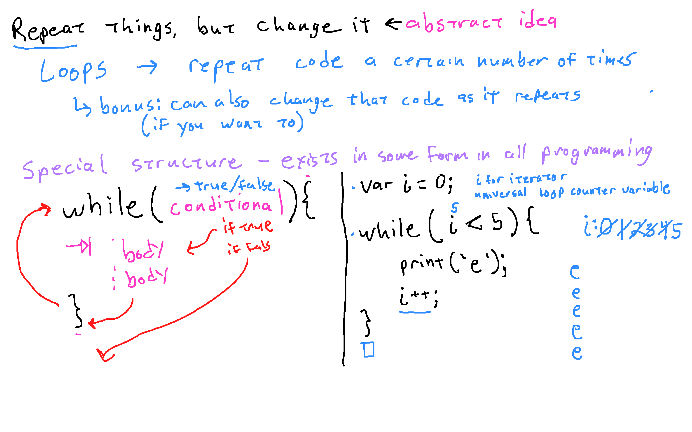


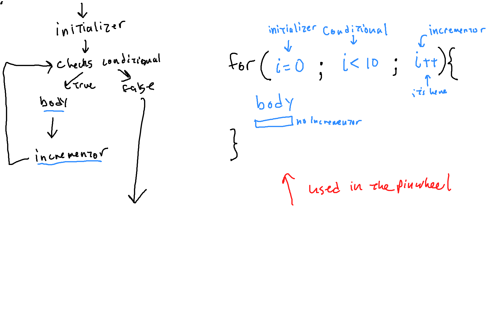


# Wednesday 30 September
We worked in groups on Loop Exercises. Here it is, all cleaned up. 

[C2 Loop Exercises.pdf](C2_Loop_Exercises.pdf)

# Monday 05 October
Reviewed homeworks:

- Falling Rock (pts 1, 2, and bonus)
- Emoji Wars

Whiteboard:


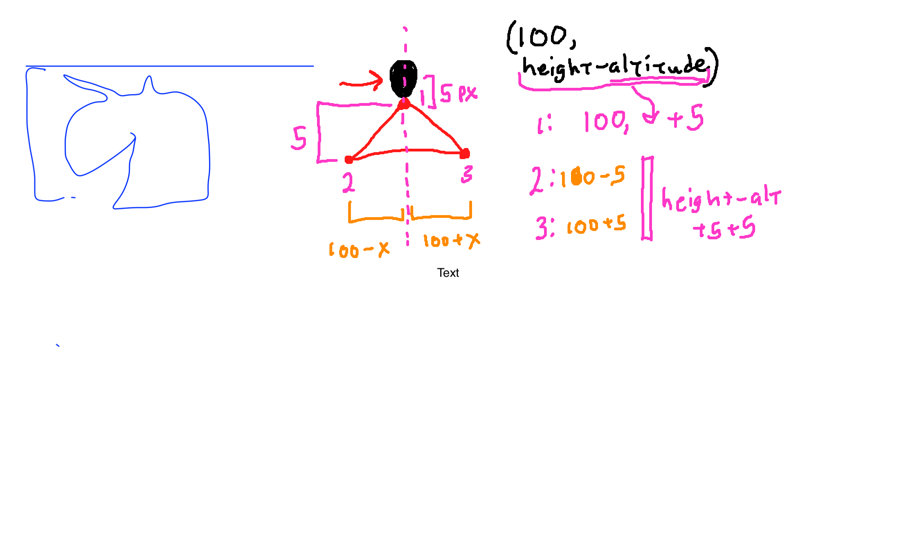


Started Task 4 from the above Loop Exercises. Here's the new trick (which we'll expand on Wednesday): 

## NESTED LOOPS

```javascript
for(let j = 0; j < 3; j++){
  for(let i = 0; i < 3; i++){
    ellipse(i * 30, j * 30, 20);
  }
}
```

# Wednesday 7 October

More work on NESTED LOOPS. We hand-executed a single loop program to draw a row of circles. Then we created a double-loop, a *nested loop*, and executed that by hand. 

Some tricks to nested loops:

- There is an *inner* and *outer* loop. The Outer loop runs first, and the inner loop is inside the body of the outer loop.

- When the inner loop starts, it runs to completion before we return to the outer loop

- When the inner loop is completely done, meaning it got "false" for its conditional check, we then proceed with the rest of the outer loop's body. If there isn't any more body, we jump back into the outer loop's flow chart at the end of the body. 

- The outer loop increments its counter, checks its conditional, and if the conditional is still true, goes into its body, just like usual. 

- When we enter the body of the outer loop a second (or subsequent) time, the inner loop is like a NEW loop to the computer, and it starts over with the initialization/setup expression, which usually sets its counter back to zero. Then it runs in its entirety again. 

Tracing the Single loop

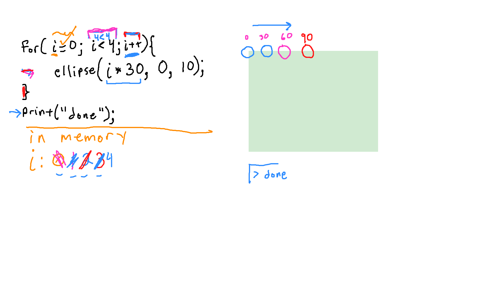

Tracing the Double loop

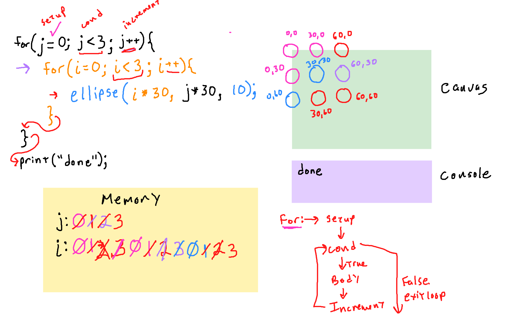

Trying to make the middle circle not print (doesn't quite work)

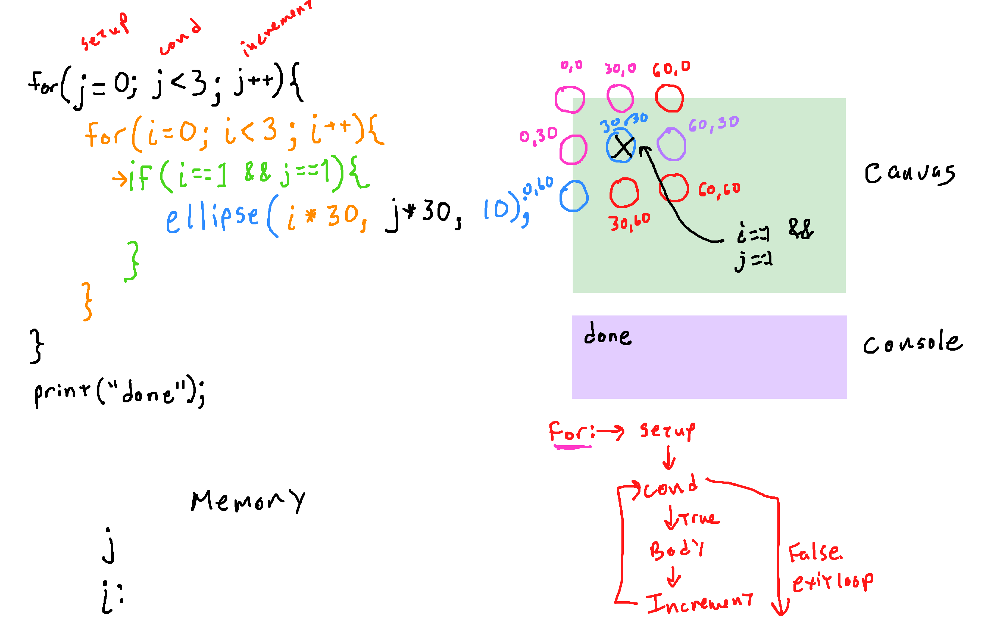

```javascript
function setup() {
  createCanvas(300, 300);
}

function draw() {
  background(220);
  translate(50, 50); // just so we can see it all on the canvas

  for(let j = 0; j < 3; j++) {
    for(let i = 0; i < 3; i++) {
      ellipse(i * 30, j * 30, 20);
    }
  }
}
```

# Monday 12 October 

Reviewed the Falling Rock jetpacks, Emoji Wars, and Pinwheels. 

## Arrays

The most critical pieces are on these two slides:


We started trying these ideas with the following example, that rotates colors whenever the mouse is clicked. (I tweaked it a little bit after class to fix a bug)

```javascript
function setup() {
  createCanvas(400, 400);
}

let colorIndex = 0;
let myColors = ['red', 'green', 'blue', 'yellow', 'pink'];

function draw() {
  background(220);
  
  fill(myColors[colorIndex]);
  ellipse(width / 2, height / 2, width, height);
}

function mouseClicked() {
  colorIndex++;
  if (colorIndex >= myColors.length) {
    colorIndex = 0;
  }
  print(colorIndex)
}
```

# Wednesday 14 October

p5 reference, as you know, is https://p5js.org/reference/

for the language itself, javascript reference is here https://www.w3schools.com/jsref/

## Looping over Arrays

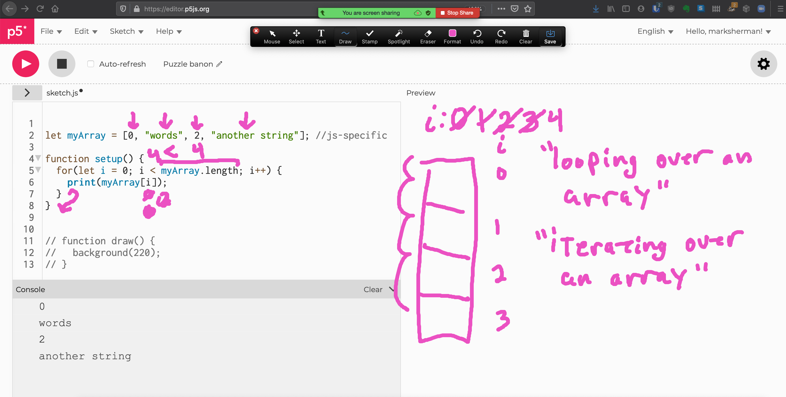

```javascript
let myArray = ['red', 'green', 'blue', 'pink', 'yellow'];

function setup() {
  createCanvas(800, 400);
  noStroke();
  
  for(let i = 0; i < myArray.length; i++) {    
    fill(myArray[i]);
    rect(100 * i, 100, 75, 75);
  }
}
```


```javascript
let myArray = [];

function setup() {
  createCanvas(800, 400);
  noStroke();
  
  for(let i = 0; i < 100; i++){
    myArray.push(i + 1);
  }
  
  for(let i = 0; i < myArray.length; i++){
    if(myArray[i] % 2 !== 0){
      print(myArray[i]);
    }
  }
}
```

## Understanding nested function calls:


## Odd and Even
Modulus Operator

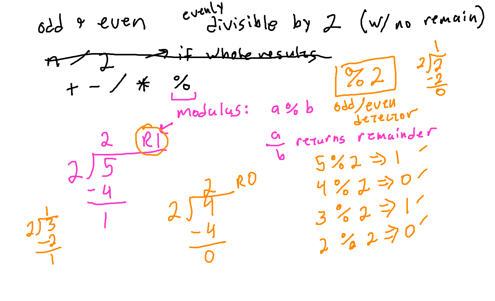


# Monday 19 October

## Functions: theory and practice

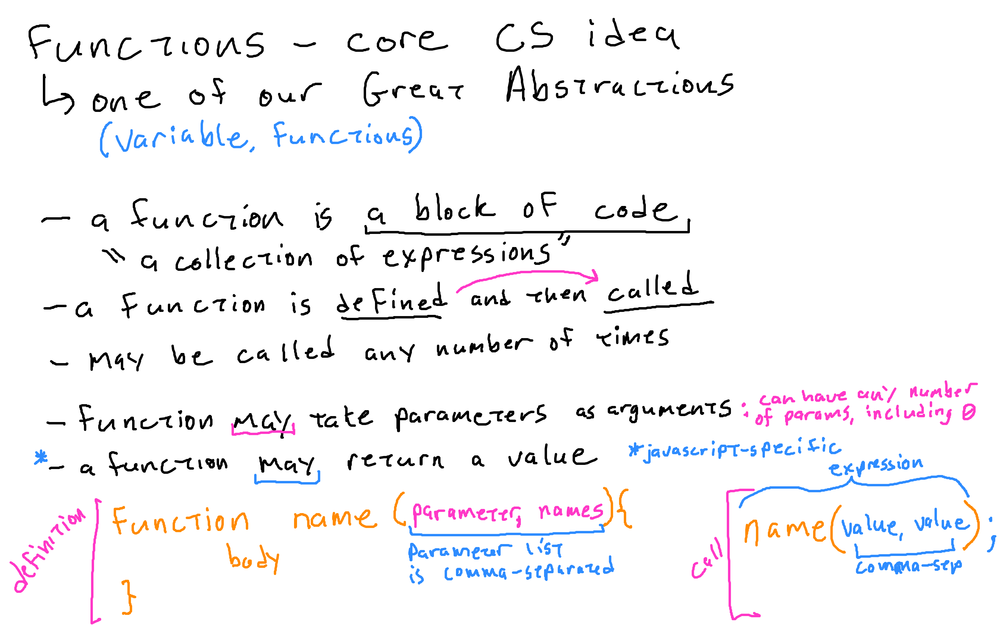


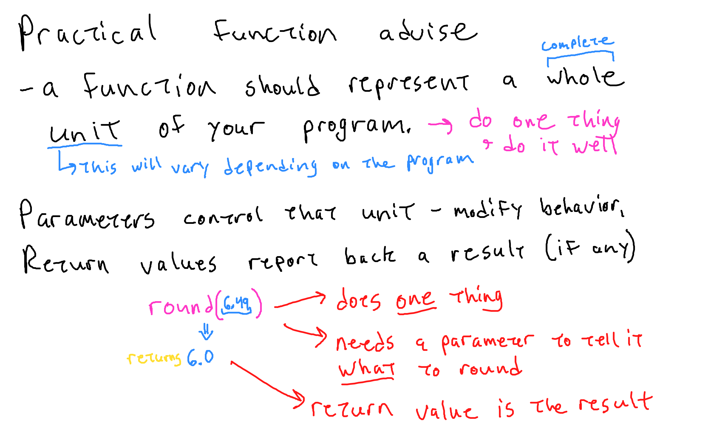

We *refactored* the first robot to use functions. We gave it two parameters: a location to center the head on as x and y, and a headColor. 
We then added some sick color transformations based on the position of the mouse to show off how much control we now have over the head unit.

The code ended up looking like this:

```javascript
function head(x, y, headColor) {
  // Antennae
  // center was 276, 155
  stroke(102);
  line(x, y, x - 30, y - 43);   // Small
  line(x, y, x + 30, y - 99);    // Tall
  line(x, y, x + 66, y + 85);   // Medium

  // rest of the head
  fill(headColor);
  ellipse(x, y, 45, 45);
  fill(255);
  ellipse(x + 12, y - 5, 14, 14);
  fill(0);
  ellipse(x + 12, y - 5, 3, 3);
  fill(153);
  ellipse(x - 13, y - 7, 5, 5);
  ellipse(x + 20, y - 25, 4, 4);
  ellipse(x + 29, y + 7, 3, 3);
}

function neck(x, y) {
  // Neck
  // original top point was 276, 162
  stroke(102);                // Set stroke to gray
  line(266, 257, x - 10, y);   // Left
  line(276, 257, x, y);   // Middle
  line(286, 257, x + 10, y);   // Right
}

function setup() {
  createCanvas(720, 480);
  strokeWeight(2);
  ellipseMode(RADIUS);
}

function draw() {
  background(204);

  neck(276, 162);
  // neck(mouseX, mouseY);

  // Body
  noStroke();                 // Disable stroke
  fill(102);                  // Set fill to gray
  ellipse(264, 377, 33, 33);  // Antigravity orb
  fill(0);
  rect(219, 257, 90, 120);
  fill(102);
  rect(219, 274, 90, 6);

  // for(let i = 0; i < 8; i++) {
  //   head(i * 90, 50, color(i*25, 0, 0));
  // }

  head(276, 155, color(mouseX, mouseY, 0));
  // head(mouseX, mouseY);
}
```

BIG IDEA OF CS alert: Functions let you create custom tools!


# Wednesday 21 October
## Reviewing Our "Stack"
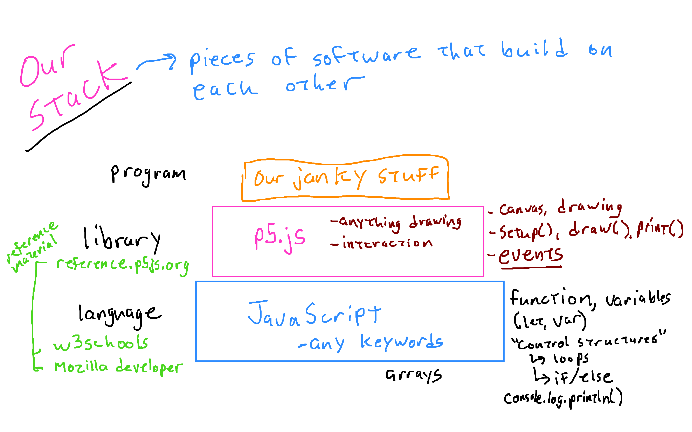

## Events
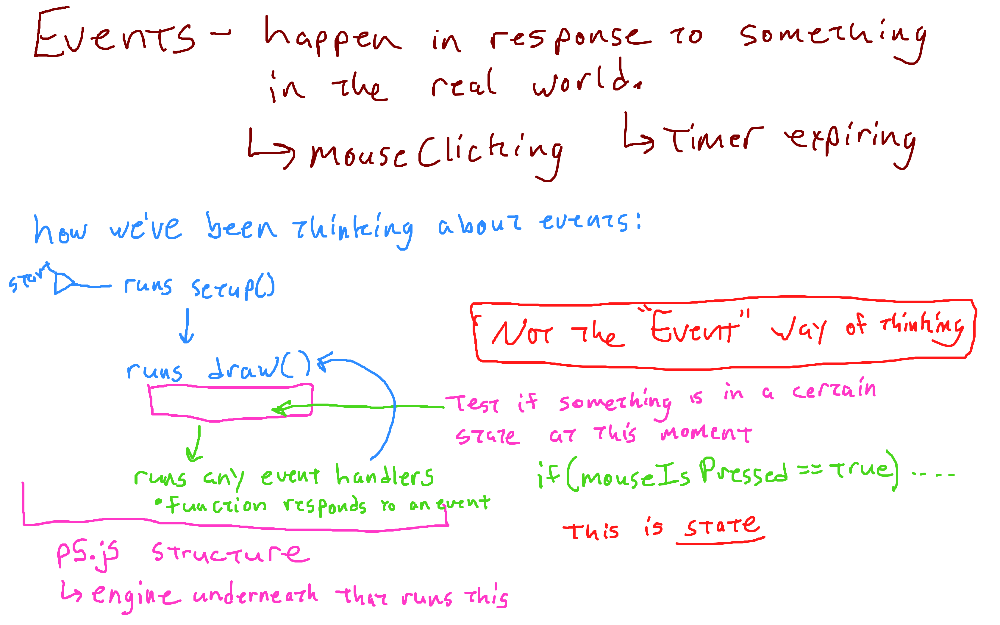


```javascript
let clickCount = 0;
let lastKey = '';

function setup() {
  createCanvas(400, 400);
  textSize(60);
}

function draw() {
  background(220);
  
  text(lastKey, 200, 200);
}

function keyTyped(){
  lastKey = key;
}
```
Event Handlers


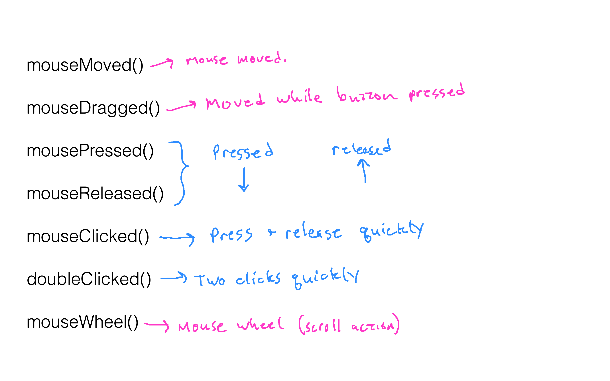

## Typing Into An Array

What does `letters.length - 1` mean?

What does `letters[letters.length - 1]` return?


```javascript
let letters = ['']; //not quite empty, but that's to prevent it from crashing before you type anything

function setup() {
  createCanvas(400, 400);
  textSize(60);
}

function draw() {
  background(220);
  for(let i = 0; i < letters.length; i++){
    text(letters[i], i * 40, 200);
  }
}

function keyTyped(){
  letters.push(key);
  print(letters);
}
```

# Monday 26 October
Cam informs us that ["Big Bootie Mix, Vol. 18"](https://www.youtube.com/watch?v=TPP6OF3Fz4A) has dropped, for all of our emotional fulfillment.

## How To Move the Heavens
What the arrays are for


What the arrays are for - continued

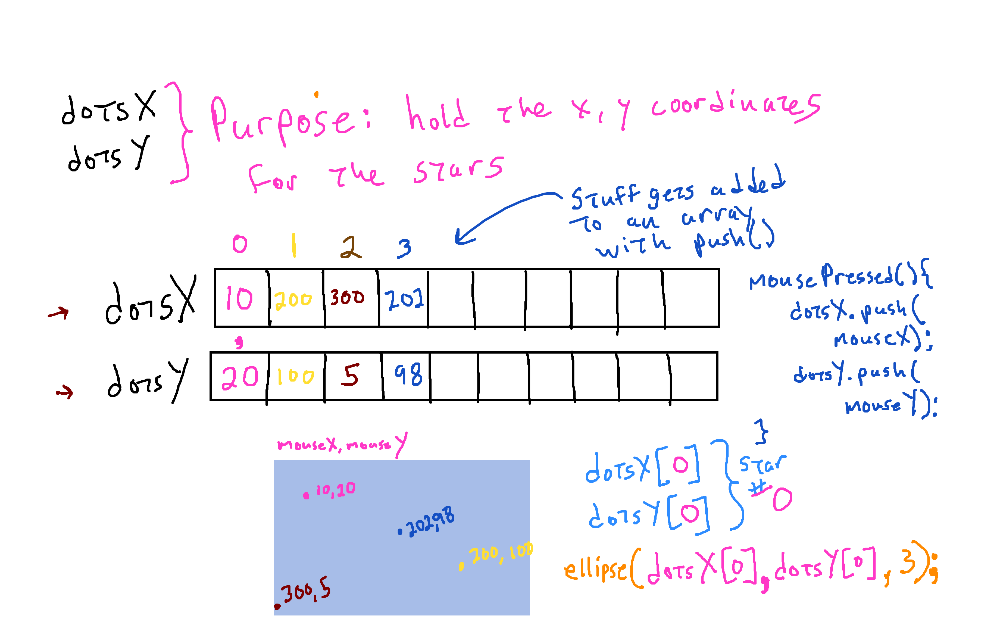

Loop over the arrays

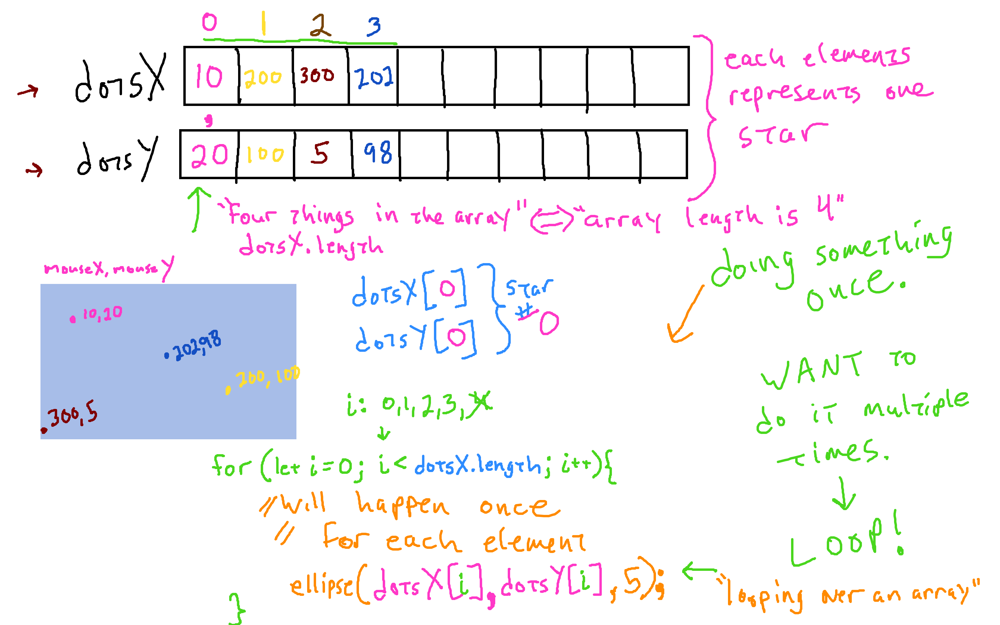

[What it means to "move" the stars

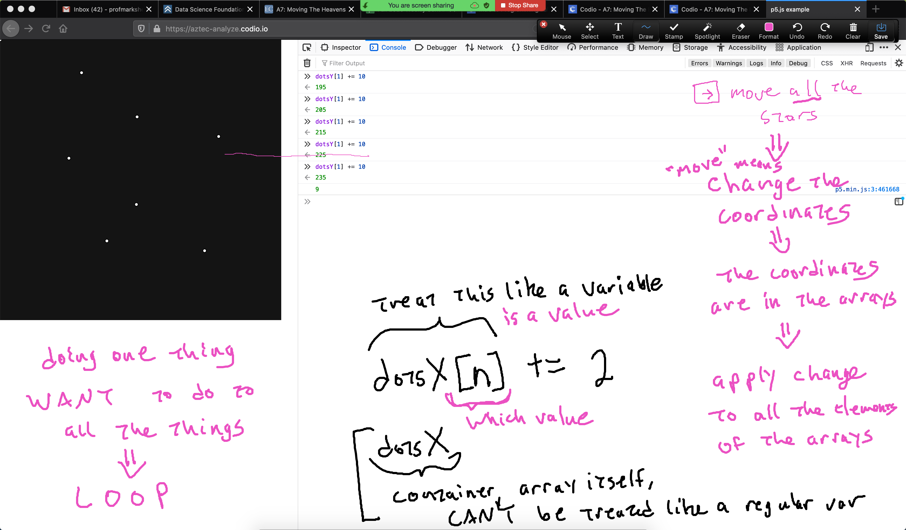


You're welcome!

# Wednesday 28 October

[Starter Code](2020-10-28/starter.js)

## Old-School Practice with Arrays

The big idea is to deeply think about how loops work with arrays. 

When the loop runs, if it was set up with an interator that goes fro 0 to array.length, you will be able to access each element of the array, in turn, one at a time. Each repeat of the body of the loop will have a different value of *i* (the iterator), so the `array[i]` will get at a different value each time. Use `array[i]` to access each element in turn. (using the proper name of the array, of course)

In the case of summing, all we have to do is add that value to a sum variable each iteration.

MISSION 1

```javascript
function setup() {
  let numbers = [85, 65, 99, 27, 24,  81, 91, 99, 61, 69, 22, 36];
  for(let i = 0; i < random(50, 150); i++){
    numbers.push(random(0,100));
  }
  
  // Student Code Starts Here
  
  // print out a SUM of all  the numbers in the array
}
```

MISSION 2

```javascript
let howMany = 20;

function setup() {
  let numbers = [];
  
  // Student Code Starts Here
  
  // you are going to fill numbers with the values from 1 to howMany
  // print that array so you know it's right
  // then print the sum of that array.

}
```

MISSION 3

```javascript
let howMany = 20;

function setup() {
  let numbers = [];
  for(let i = 0; i < howMany; i++){
    numbers.push(random(-10,10));
  }
  
  // Student Code Starts Here
  
  // print the array (so we can check it)
  print(numbers);
  
  // print out a SUM of all the POSITIVE numbers in the array
}
```

## Sidenote: Rounding Error


In javascript, all numbers are encoded as "floating point." There's a small issue with floating point numbers, which is that math with decimals, *specifically division*, can sometimes create rounding error. If you expect a number like `63.25` and what you see is `63.2500000000001` or `63.2499999999999999` then you've found some rounding error. It's part of life. There are ways to mitigate the effects, depending on what you're trying to do. One answer is to use the `round()` function, but again, it depends on what's going on in your program. It probably won't even matter! Just making you aware in case you  see this.

# Monday 2 November
## Introducing Objects
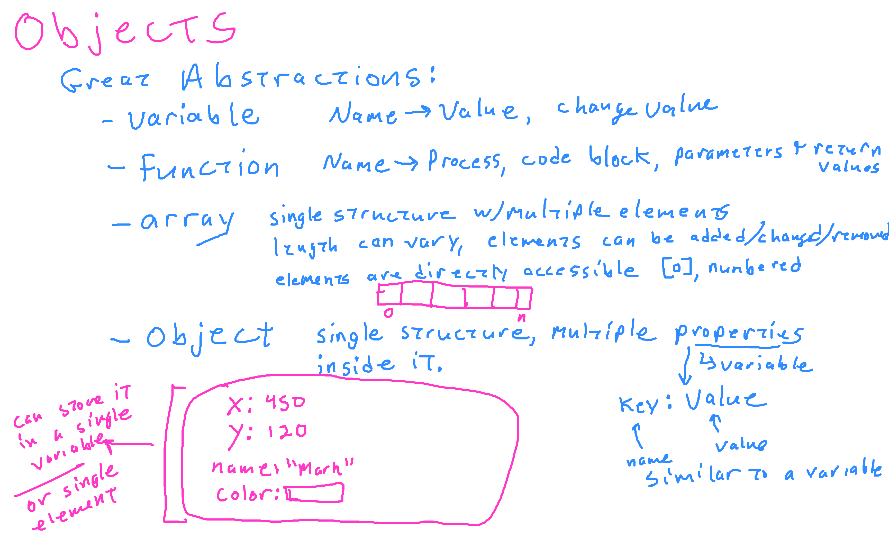

Refactored *Moving The Heavens* to use Objects for stars


How To Write an Object


Our code is getting quite *expressive,* conveying much meaning in a small amount of text. See this example, from *Move The Heavens:*

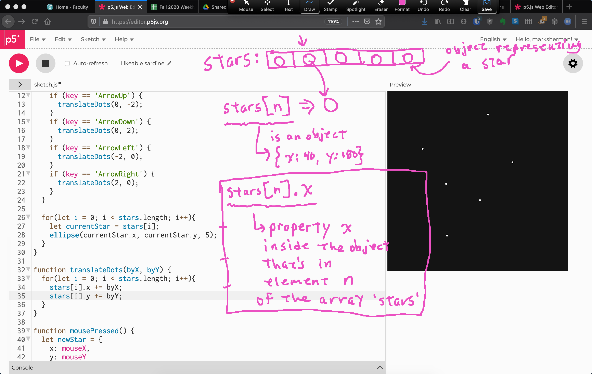

The expression `stars[n].x` means "the value of property x inside the object stored in element n of the array *stars*." That's a new level of conciseness for us, with many levels of abstraction built-in, but it's also powerful. So much instruction and abstraction so elegantly represented. 

Of course, with that expression, it's result is an object propery, which we can do whatever we want to in the same way we could a variable. Read it, assign to it, re-assign it, increment it (shown below), whatever!


Then we started with our new friend the Jitterbug. The end of our first day with them:

```javascript
// Jitterbug!

let bug = {
  x: 0,
  y: 0,
  color: "pink",
  speed: 1
};

let bug2 = {  // in each object
  x: 0,        // is the STATE of the bug
  y: 0,
  color: "green",
  speed: 2
};

let tina = {
  x: 0,
  y: 0,
  color: "red",
  speed: 1.5
};

function setup() {
  createCanvas(400, 400);
  background(220);
  // noStroke();
  stroke(150);
  
  initializeBug(bug);
  initializeBug(bug2);
  initializeBug(tina);
}

function initializeBug(bug) {
  bug.x = width / 2;
  bug.y = height / 2;
}

function drawBug(bug){
  fill(bug.color);
  
  bug.x += random(-bug.speed, bug.speed);
  bug.y += random(-bug.speed, bug.speed);
  
  ellipse(bug.x, bug.y, 10);
}

function draw() {
  drawBug(bug);
  drawBug(bug2);
  drawBug(tina);
}
```

# Wednesday 4 November
## Objects as sprites
A 'sprite' is a single entity on screen. The word comes from mythology, meaning a small fairy. A graphics sprite can move as a unit, change shape or size or color, or anythig else the programmer wants. The original Super Mario World, Pokémon, and Sonic the Hedgehog are great examples of sprite-based games.

The idea of the sprite can help us. Using objects, we can create logical units that represent an entity on the screen- a sprite. The object behind the sprite can hold all the information needed for that particular sprite, and they can safely interact with each other because their data is separated. We practiced that today.

## Going inside an object
You can access any property inside of an object using the dot operator. If you have an object named `boo` and it has a property called `color`, you can access it as `boo.color` and treat it like a usual variable. Read it, update it, whatever.

When you're inside a an object, you should use the keyword `this` to refer to the object that you're in. An example is below, in the `drawMe` property of `boo`: you'll see `this.x` and `this.y` among others. This code is saying "in THIS object, the one we're in right now, use the property x." This is the correct way to reference a property when you're inside the object itself, because you won't always know its name. 

Boo starter code:

```javascript
// meet Boo!
// Boo is an object that represents a sprite. It has the following properties:
// .x
// .y
// .w
// .h
// .drawMe() <- they have their own draw function! it takes no arguments.

let boo = {
  x: 200,
  y: 200,
  w: 15,
  h: 15,
  drawMe: function () {rect(this.x, this.y, this.w, this.h);}
}

function setup() {
  createCanvas(400, 400);
  rectMode(CENTER)
}

function draw() {
  background(220);
  boo.drawMe();
}

// Task1 : make the sprite move with the arrow keys
// Task2 : give the sprite a fill and stroke color - use those colors in boo's draw function
// Task3 : copy boo to make bee, and give it DIFFERENT colors and a different SHAPE 
//  (but keep all of its "interfaces" the same- x, y, w, h, draw)
```

Once those tasks were complete and reviewed, here were next tasks:

```javascript
// Task4: make bee move with WASD w up; a left; s down; d right
// Task5: make bee "float" - move a little bit even when no keys are press
// Task6: make the space bar change the color of boo
```

My favorite pokémon is Kadabra. Blastoise is a close second.

# Monday 9 November

At this point we're combining concepts. Here's a quick breakdown of all the ideas that were included in today's lesson:

* objects
	* creation by a literal
	* accessing internals
	* storing in a variable
* functions
	* parameters can be passed in
	* parameters become readable values, like variables, inside the body of the function
	* return value
* arrrays
	* length, and the `.length` property
	* index operations using `[]`
	* adding new elements with `.push()`
	* replacing elements by updating value with the index operator `[]`
* variables
	* scope
		* variables are accessible only in the scope in which they're *created*
		* `let` is the tightest-scoping. Using `let` with a `for` loop means the variable will only exist in that loop
		* `var` in a `for` loop will actually scope to the whole encoclsing function
	* can store any single value
	* an object or an array both qualify as "a single value"
* expressions
	* expressions are built out of smaller expressions
	* can be combined and nested
	* pull an expression apart into its pieces if you don't understand it
	* example: `bugs[n].x` is a variable named `bugs` and a variable named `n`. `bugs` contains an array; `n` contains an integer. In that array, the element at position `n` is an object, which has a property named `x`. The value of that property `x` is what that expression would return. That property is also what would be updated if this expression is followed by an assignment operator. 

For skills, we practiced how to "trace" a running program by following the code, running it slowly on paper so that we better understand it. Write out everything that's being put in memory (variables, arguments, etc) so that you can follow their changes over time as you trace.


	
without further ado, the final Jitter Bug program:

```javascript
/************************************************************************
 * This program further abstracts our jitter bug object:                *
 * it creates bugs using the makeBug function,                          *
 * stores them in an array (allowing an arbitrary number of them), and  *
 * calls each bug's move function whenever draw() is called.            *
 * As a bonus, it removed bugs once they leave the canvas and replaces  *
 * that bug with a brand-new one.                                       *
 * It also randomizes color and speed of new bugs.                      *
 ************************************************************************/
 

function makeBug(speed, color) {
  var bug = {
    x: width / 2,
    y: height / 2,
    move: function() {
      this.x += random(-speed, speed);
      this.y += random(-speed, speed);
      fill(color);
      ellipse(this.x, this.y, 5);
    }
  }
  return bug;
}

let bugs = [];

function setup() {
  createCanvas(600, 600);
  background(220);
  noStroke();
  
  for(let i = 0; i < 500; i++){
    let newColor = color(random(0, 255), random(0, 255), random(0, 255));
    bugs.push(makeBug(random(0.5, 6), newColor));
  }
}

function draw() {
  for(let i = 0; i < bugs.length; i++){
    let currentBug = bugs[i];
    if(currentBug.x < 0 || currentBug.x > width || 
       currentBug.y < 0 || currentBug.y > height){
      print(currentBug.x, currentBug.y);
      let newColor = color(random(0, 255), random(0, 255), random(0, 255));
      currentBug = makeBug(random(0.5, 6), newColor);
      bugs[i] = currentBug;
    }
    currentBug.move();
  }
}
```

# Wednesday 11 November
Introduced the next assignment: A8 Lunar Lander

## Media (ch. 7)

New p5-provided function called `preload`

Like `setup` and `draw`, you define `preload` but you never call it. p5 calls it for you at the right time. The purpose of `preload` is to load all of your media assets, which can take some time and you don't want to screw your program up by starting it before all the media assets are ready. 

The `preload` function runs once, before the `setup` function runs.


## Linting
We added a code-checking system. It is called a *linter,* or more formally, a *static analyzer.* It checks your code for issues, which include potential errors and bugs, bad form, and style. 

I added linter functionality to the codio interface, as seen below. The linter outputs the line and column of the error, and a description of what the error is. 

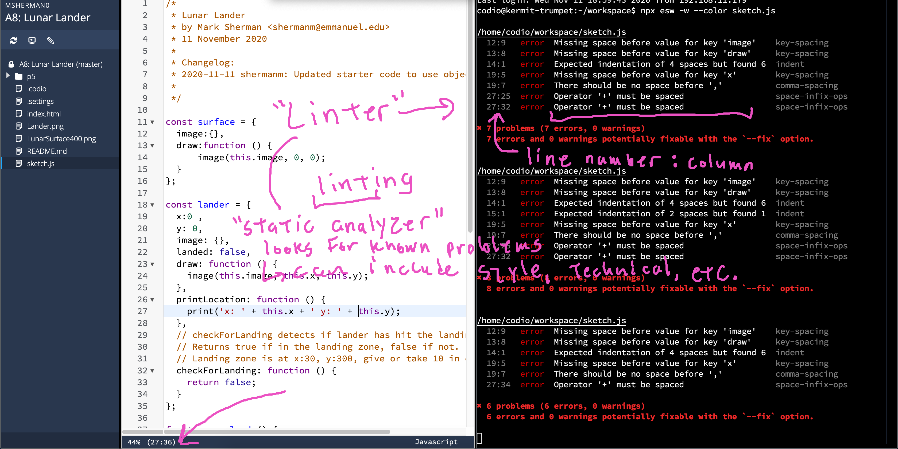

# Monday 16 November

## Motion (Ch. 8) - Animation


Ch. 8 example on timing, re-introducing the `millis` function and how it measures time. 


# Tuesday 18 November
## Circular Motion
Moving through Chapter 8, we talked about circular motion. This required a brush-up on our middle school trigonometry, specifically the `sin` and `cos` functions.

Don't forget about radians!


Oh, no, I forgot an important thing!
Radians are default in p5, but you can switch the modes using `angleMode(DEGREES)` or `angleMode(RADIANS)`

Here's the collection of Ch.8 examples, including some of my improvised examples:

[Ch.8 Motion on p5js.org](https://editor.p5js.org/marksherman/collections/qHStD7lz8)

Trig functions, like `sin` can be used in any case where you want to generate a pulsing, periodic, set of values. 


